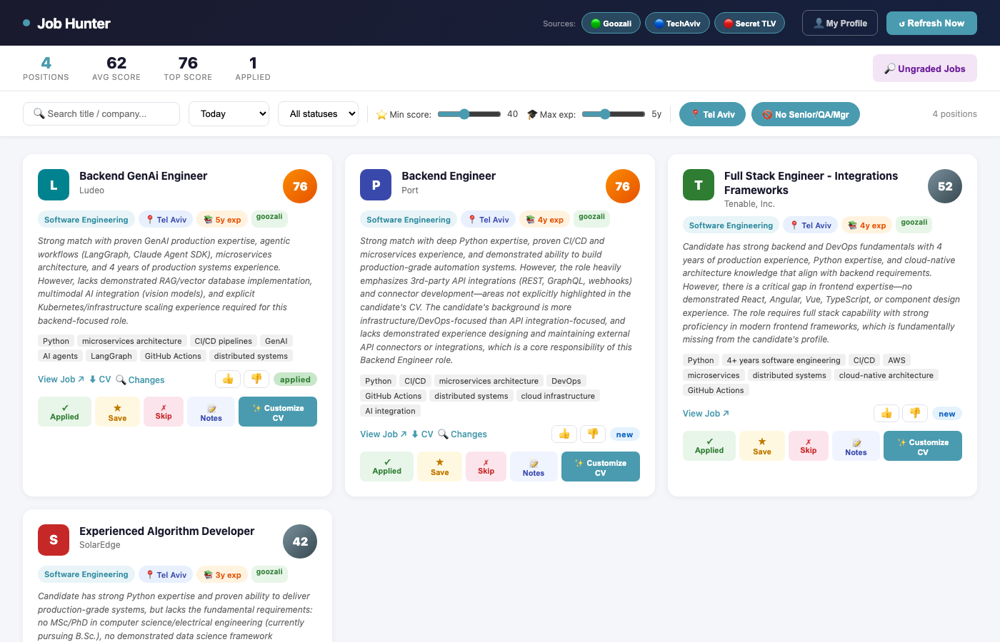

# Job Hunter

> Personal job-hunting automation for the Israeli tech market. Scrapes three job boards daily, scores every listing against your CV using Claude AI, generates tailored 1-page CVs, and surfaces the best matches in a local dashboard.


---

## Dashboard



---

## How It Works

```
Job Boards (Goozali · TechAviv · Secret Tel Aviv)
        │
        ▼
   Scraper layer  ──→  jobs.db (SQLite)
        │
        ▼
   Matcher (Claude Haiku)
   Phase 1: keyword pre-score (free)
   Phase 2: top 50 → Claude API (~$0.02/day)
   Phase 3: borderline TechAviv jobs rescored with full page text
        │
        ▼
   Tailor (Claude Sonnet)
   Generates a tailored 1-page CV PDF per matched job (score ≥ 60)
        │
        ▼
   Dashboard (Flask · http://localhost:3000)
   Filter · sort · thumbs up/down feedback · download PDF · track status
```

---

## Features

- **3 scrapers** — Goozali (Airtable/Playwright), TechAviv (REST API), Secret Tel Aviv (HTML)
- **Smart scoring** — keyword pre-filter keeps Claude API costs low; only top 50 jobs hit the API per run
- **Feedback loop** — thumbs up/down trains future scoring via dynamic system prompt enrichment
- **1-page CV tailoring** — Claude Sonnet rewrites your CV for each role; ReportLab renders to PDF with auto-shrink to enforce single page
- **Daily automation** — APScheduler runs the full pipeline at 08:00; "Refresh Now" button for on-demand runs
- **Application tracking** — per-job status (`new` → `applied` → `interviewing` → `rejected` → `offer`) with notes

---

## Setup

**Prerequisites:** Python 3.12+, pip

```bash
git clone https://github.com/DorKaminsky/job-hunter
cd job-hunter

python3 -m venv venv
source venv/bin/activate
pip install -r requirements.txt
playwright install chromium

cp .env.example .env
# Edit .env — set ANTHROPIC_API_KEY and CV_PATH
```

**.env values:**

| Variable | Description |
|----------|-------------|
| `ANTHROPIC_API_KEY` | Your Anthropic API key |
| `CV_PATH` | Absolute path to your master CV PDF |

---

## Running

```bash
source venv/bin/activate
python3 dashboard/dashboard.py
```

Open **http://localhost:3000** — the daily pipeline runs automatically at 08:00, or click **Refresh Now**.

### Manual pipeline steps

```bash
python3 scraper/scraper.py            # Goozali
python3 scraper/techaviv.py           # TechAviv
python3 scraper/secrettelaviv.py      # Secret Tel Aviv
python3 matcher/matcher.py cv.pdf     # Score all unmatched jobs
python3 tailor/tailor.py cv.pdf       # Generate tailored CVs (score ≥ 60)
```

---

## Project Structure

```
job-hunter/
├── scraper/
│   ├── scraper.py          # Goozali — Airtable shared view via Playwright intercept
│   ├── techaviv.py         # TechAviv — REST API
│   └── secrettelaviv.py    # Secret Tel Aviv — HTML scraper
├── matcher/
│   └── matcher.py          # 3-phase scoring: keyword → Claude Haiku → Playwright rescore
├── tailor/
│   └── tailor.py           # Claude Sonnet CV tailoring → ReportLab PDF
├── dashboard/
│   └── dashboard.py        # Flask server + APScheduler + embedded SPA
├── shared/
│   ├── config.py           # All tunable constants
│   └── db.py               # SQLite schema + connection helper
├── requirements.txt
└── .env.example
```

---

## Configuration

All tunables live in `shared/config.py`:

| Constant | Default | Description |
|----------|---------|-------------|
| `MATCH_SCORE_THRESHOLD` | 60 | Minimum score to trigger CV tailoring |
| `TOP_N_CLAUDE` | 50 | Max jobs sent to Claude per run |
| `TECHAVIV_RESCORE_MIN/MAX` | 30 / 65 | Borderline score window for full-page rescore |
| `CV_SKILLS` | 59 keywords | Used for Phase 1 keyword pre-scoring |
| `EXCLUDED_TITLE_KEYWORDS` | list | Filters out senior/QA/manager roles automatically |

---

## Cost

Roughly **$0.02/day** for scoring (Claude Haiku, ~50 calls) + ~$0.05 per tailored CV (Claude Sonnet). Most runs cost under $0.10 total.

---

## Notes

- Local deployment only — no auth, no multi-user support
- macOS port 5000 is blocked by AirPlay; dashboard uses **3000**
- The Goozali scraper depends on an Airtable shared view URL — update `GOOZALI_SHARE_URL` in `config.py` if it expires
